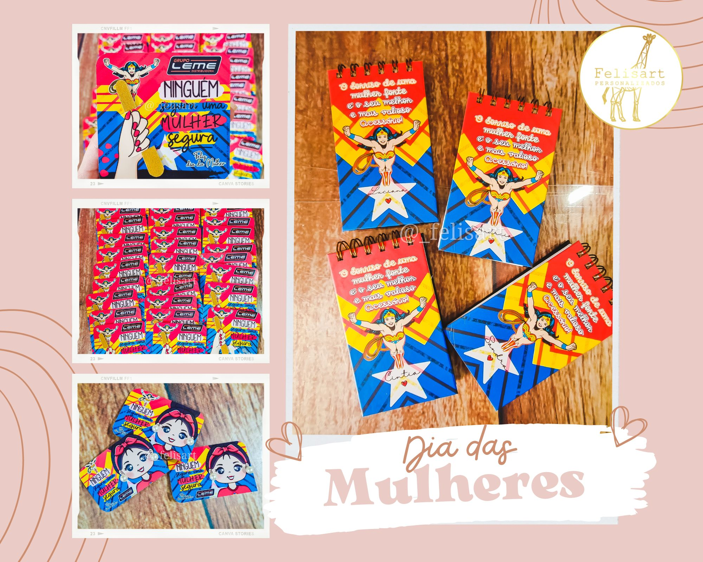

# 📸 Guia Completo: Como Adicionar Imagens na Galeria

## 🖼️ **Passo a Passo para Adicionar Imagens:**

### **1. Preparar as Imagens**
- **Formato**: JPG, PNG ou WebP (recomendado)
- **Tamanho**: 800x800px (quadrado) para melhor visualização
- **Qualidade**: Boa resolução, mas otimizada para web
- **Nomes**: Use nomes descritivos como `caneca-personalizada-1.jpg` ou `.png`

### **2. Onde Colocar as Imagens**
Crie uma pasta `images` na raiz do seu site:
```
meu-site/
├── index.html
├── styles.css
├── script.js
├── logo-felisart.png
└── images/
    ├── galeria-1.jpg (ou .png)
    ├── galeria-2.jpg (ou .png)
    ├── galeria-3.jpg (ou .png)
    ├── galeria-4.jpg (ou .png)
    ├── galeria-5.jpg (ou .png)
    └── galeria-6.jpg (ou .png)
```

### **3. Editar o HTML da Galeria**
Substitua os placeholders na seção da galeria:

```html
<div class="gallery-grid">
    <div class="gallery-item">
        
    </div>
    <div class="gallery-item">
        
    </div>
    <div class="gallery-item">
        
    </div>
    <div class="gallery-item">
        
    </div>
    <div class="gallery-item">
        
    </div>
    <div class="gallery-item">
        
    </div>
</div>
```

### **4. Adicionar Estilos CSS**
Adicione este CSS para as imagens:

```css
.gallery-img {
    width: 100%;
    height: 100%;
    object-fit: cover;
    border-radius: 12px;
    transition: transform 0.3s ease;
}

.gallery-item:hover .gallery-img {
    transform: scale(1.05);
}
```

## 🖼️ **Suporte a Formatos de Imagem:**

### **Formatos Aceitos:**
- **JPG**: Ideal para fotos com muitas cores
- **PNG**: Ideal para imagens com transparência ou texto
- **WebP**: Formato moderno, menor tamanho (recomendado)

### **Como Funciona:**
- **Prioridade JPG**: Tenta carregar `.jpg` primeiro
- **Fallback PNG**: Se não encontrar JPG, carrega `.png`
- **Automático**: Você pode usar qualquer um dos formatos

### **Exemplo de Uso:**
```
images/
├── galeria-1.jpg  ← Se existir, usa este
├── galeria-1.png  ← Se JPG não existir, usa este
├── galeria-2.png  ← Se existir, usa este
└── galeria-2.jpg  ← Se PNG não existir, usa este
```

## 🛠️ **Ferramentas para Otimizar Imagens:**

### **Gratuitas Online:**
- **TinyPNG**: Comprime JPG e PNG sem perder qualidade
- **Squoosh**: Google - redimensiona e comprime
- **Canva**: Cria quadrados perfeitos (800x800px)

### **Como Usar o TinyPNG:**
1. Acesse [tinypng.com](https://tinypng.com)
2. Arraste suas imagens
3. Baixe as versões otimizadas
4. Renomeie para `galeria-1.jpg`, `galeria-2.jpg`, etc.

## 📱 **Dicas para Fotos dos Produtos:**

### **Iluminação:**
- Use luz natural (perto da janela)
- Evite sombras fortes
- Fundo neutro (branco ou cinza claro)

### **Ângulos:**
- Foto frontal do produto
- Destaque para a personalização
- Mostre detalhes importantes

### **Qualidade:**
- Use a câmera do celular em boa resolução
- Mantenha o foco no produto
- Evite fotos borradas

## 🔄 **Como Atualizar a Galeria:**

### **Método 1: Substituir Imagens Existentes**
1. Mantenha os mesmos nomes (`galeria-1.jpg`, etc.)
2. Substitua as imagens na pasta `images`
3. Faça upload no GitHub

### **Método 2: Adicionar Mais Imagens**
1. Adicione novos itens na galeria:
```html
<div class="gallery-item">
    
</div>
```

## 🎨 **Exemplo de Estrutura Final:**

```html
<div class="gallery-grid">
    <!-- Canecas -->
    <div class="gallery-item">
        
    </div>
    <div class="gallery-item">
        
    </div>
    
    <!-- Camisetas -->
    <div class="gallery-item">
        
    </div>
    <div class="gallery-item">
        
    </div>
    
    <!-- Quadros -->
    <div class="gallery-item">
        
    </div>
    <div class="gallery-item">
        
    </div>
</div>
```

## ⚡ **Dicas Importantes:**

1. **Sempre use nomes descritivos** para as imagens
2. **Mantenha o tamanho quadrado** (800x800px)
3. **Otimize as imagens** antes de fazer upload
4. **Teste em diferentes dispositivos** após adicionar
5. **Mantenha backup** das imagens originais

## 🚀 **Próximos Passos:**

1. **Baixe a logo** do Instagram/Facebook
2. **Renomeie** para `logo-felisart.png`
3. **Prepare 6 fotos** dos seus melhores trabalhos
4. **Otimize as imagens** usando TinyPNG
5. **Faça upload** no GitHub junto com os outros arquivos

**Pronto! Sua galeria ficará incrível com as fotos reais dos seus produtos!** 📸✨
